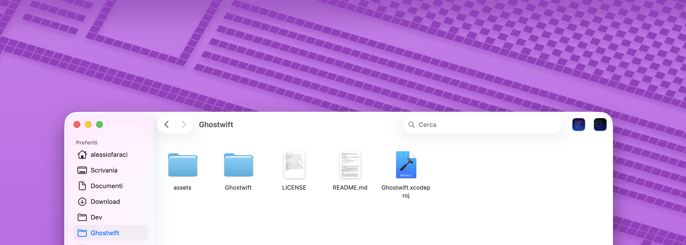
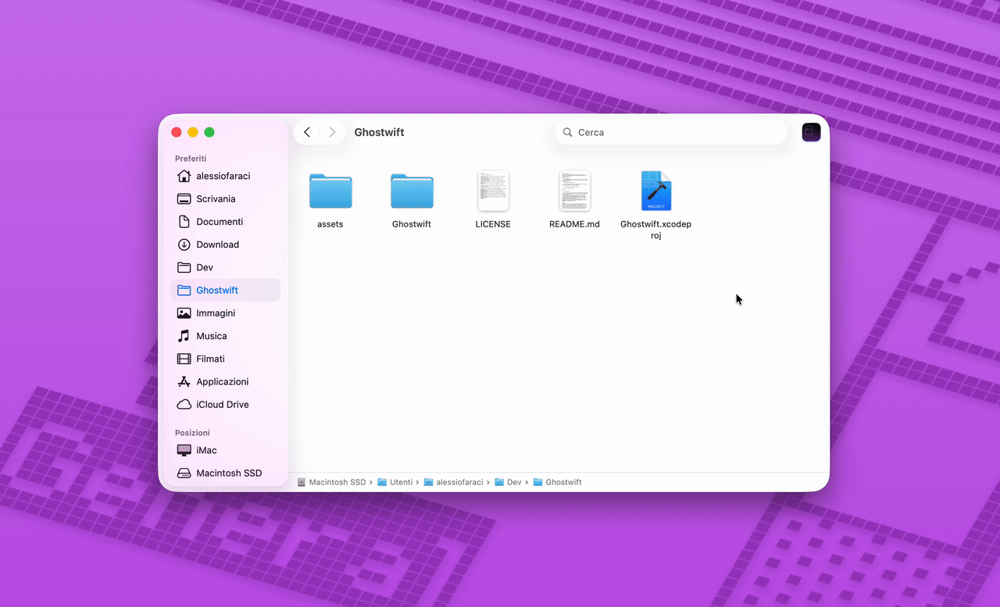

<h1>

  
   Ghostwift
</h1>
  

    A lightweight macOS utility that opens your current Finder folder path directly in the <a href="https://github.com/ghostty-org/ghostty">Ghostty</a>.
     
    <a href="#about">About</a>
    ·
    <a href="https://github.com/alefaraci/Ghostwift/releases/download/v1.0/Ghostwift.dmg">Download</a>
    ·
    <a href="#installation">Installation</a>
    ·
    <a href="#usage">Usage</a>
  

  
  
  
  
  

## About
`Ghostwift` is a native [`Swift`](https://www.swift.org)/[`AppKit`](https://developer.apple.com/documentation/appkit) app that runs as a background agent (`LSUIElement`) — no dock icon, no menu bar, no UI. When launched, it queries the frontmost Finder window for its directory and opens that path in `Ghostty`. The first time you run `Ghostwift`, macOS will ask you to grant it **automation permission** to control Finder.

> [!IMPORTANT]
> `Ghostwift` requires the [`Ghostty` terminal](https://ghostty.org) to be installed on your Mac.

## Installation

1. Download [`Ghostwift.dmg`](https://github.com/alefaraci/Ghostwift/releases/download/v1.0/Ghostwift.dmg) file;
2. Move `Ghostwift.app` to `/Applications` folder;
3. Go to the `/Applications` folder. While holding the `cmd` key, drag `Ghostwift.app` to the Finder toolbar.

## Usage

1. Navigate to a folder path you want to open with `Ghostty`;
2. Click on the `Ghostwift` toolbar icon.

The Finder folder path will open in `Ghostty` terminal.

Here's a quick demo:

> [!IMPORTANT]
> If you see a message that the app cannot be opened because it is from an unidentified developer, follow these steps:
>
> 1. Open `System Preferences` > `Security & Privacy Settings`;
> 2. Look towards the bottom of the window for a message saying: *"Ghostwift was blocked from use because it is not from an identified developer."*;
> 3. Click `Open Anyway` (you may need to enter your admin password);
> 4. Click on the `Ghostwift` icon again in Finder;
> 5. A confirmation dialog will appear — click `Open` to confirm.

## Credit

App icon inspired by the [`Ghostty Logomark`](https://ghostty.org/brand). "Ghostty" and the Ghostty logo are trademarks of Mitchell Hashimoto. `Ghostwift` is not affiliated with or endorsed by Mitchell Hashimoto or the Ghostty project.

## Author

Alessio Faraci, [afaraci.com](https://afaraci.com).

## License

Licensed under the [MIT license](https://github.com/alefaraci/Ghostwift/blob/main/LICENSE).
